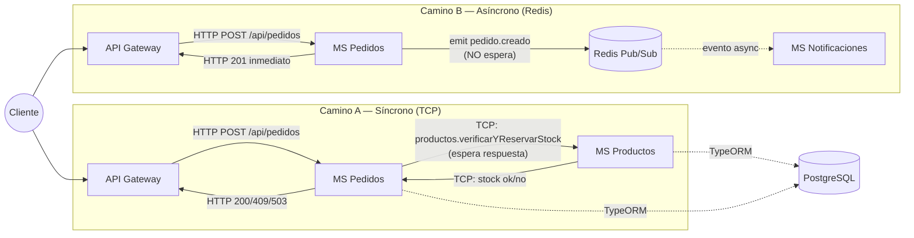
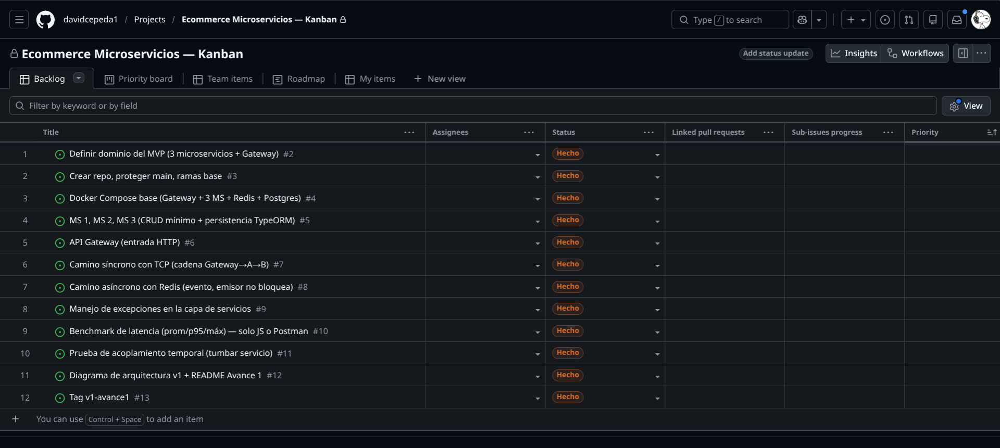

<!--
============================================================
 README — Proyecto de Microservicios (3 avances)
============================================================
-->

# EcommerceMicroServicios

> MVP de arquitectura de microservicios · Arquitectura de Software · 7.° semestre · Entrega por avances.

## 👥 Equipo
| Integrante | Rol | GitHub |
|---|---|---|
| David Gustavo Cepeda Salguero | Backend / Arquitectura | [@davidcepeda1](https://github.com/davidcepeda1) |
| Zaith Alejandro Manangón Vinueza | Transportes / gRPC | [@zmanangon09](https://github.com/zmanangon09) |
| Brayan Josué Jácome Noroña | Seguridad / Observabilidad | [@BrayanJac](https://github.com/BrayanJac) |
| Juan Carlos Granda Arcos | Documentación / QA | [@Juangranda3424](https://github.com/Juangranda3424) |

## 🧩 Descripción del MVP
Sistema de e-commerce simplificado a 2-3 entidades para poder concentrar el esfuerzo en la **arquitectura de comunicación** entre microservicios y no en features de negocio. Un cliente crea un **pedido** de un **producto**; el sistema valida stock en tiempo real (camino síncrono) y, si el pedido se confirma, dispara una **notificación** desacoplada en el tiempo (camino asíncrono).

- **MS 1 — Pedidos:** crea pedidos, orquesta la validación/reserva de stock contra Productos (TCP) y publica el evento `pedido.creado` en Redis.
- **MS 2 — Productos:** catálogo con persistencia TypeORM/Postgres; expone la verificación y reserva de stock por TCP.
- **MS 3 — Notificaciones:** suscriptor de Redis que simula el envío de una confirmación (email/push) al consumir el evento `pedido.creado`.
- **API Gateway:** punto único de entrada HTTP; traduce peticiones REST a llamadas TCP hacia Pedidos/Productos.

## 🛠️ Stack
- **Framework:** NestJS (monorepo con **pnpm workspaces**, 4 apps independientes en `apps/*`)
- **Síncrono:** TCP · **Eventos:** Redis (Pub/Sub) · **2.º transporte:** *(Avance 2)* · **Contrato:** gRPC *(Avance 2)*
- **Seguridad:** JWT + Guard *(Avance 3)* · **Observabilidad:** Sentry *(Avance 3)*
- **BD:** PostgreSQL (TypeORM) · **Contenedores:** Docker Compose · **Estructura:** monorepo (pnpm workspaces)

## ▶️ Cómo ejecutar
```bash
docker compose up -d --build
docker compose ps
curl http://localhost:3000/api/productos
```

Crear un pedido (camino síncrono, requiere un `productoId` real devuelto por el endpoint anterior):
```bash
curl -X POST http://localhost:3000/api/pedidos \
  -H "Content-Type: application/json" \
  -d '{"productoId": "<uuid-de-producto>", "cantidad": 1}'
```

Crear un pedido por el camino asíncrono (solo publica el evento, no valida stock ni persiste):
```bash
curl -X POST http://localhost:3000/api/pedidos/async \
  -H "Content-Type: application/json" \
  -d '{"productoId": "<uuid-de-producto>", "cantidad": 1}'
```

## 🏗️ Arquitectura



**Nota:** en la implementación real, `POST /api/pedidos` ejecuta *ambos* caminos en una sola operación de negocio: espera el salto síncrono a Productos (reserva de stock) y, tras confirmar, publica el evento asíncrono a Notificaciones sin esperarlo. El endpoint `POST /api/pedidos/async` existe además como una variante puramente asíncrona (sin validación de stock), usada para poder **medir y comparar de forma aislada** la latencia de cada camino en el benchmark.

## 🧭 Metodología
- **Kanban:** [GitHub Projects](https://github.com/users/davidcepeda1/projects/1) (captura: `docs/kanban-avance1.png`).
- **Ramificación:** GitHub Flow — `main` protegida, ramas `feat/…`, `fix/…`, `docs/…`, Pull Requests revisados por otro integrante, tags por avance (`v1-avance1`, `v2-avance2`, `v3-final`).
- **Commits semánticos:** Conventional Commits (`tipo(alcance): descripción`).

  ```
  feat(productos): agregar entidad Producto y validación de stock vía TCP
  feat(pedidos): publicar evento pedido.creado en Redis sin bloquear la respuesta
  feat(gateway): exponer POST /api/pedidos y /api/pedidos/async
  fix(pedidos): controlar timeout de MS Productos con RpcException 503
  perf(benchmark): adaptar benchmark.js para soportar POST con body JSON
  docs(readme): documentar Avance 1 con diagrama y tabla de latencias
  ```

## 🗺️ Patrones y principios aplicados
- **API Gateway** — `apps/gateway` centraliza el punto de entrada HTTP y oculta la topología interna (TCP) de los 3 microservicios al cliente.
- **Proxy** — `ClientProxy` de NestJS actúa como proxy remoto: el código de Pedidos invoca `productosClient.send(...)` como si fuera una llamada local.
- **Publisher/Subscriber** — MS Pedidos publica `pedido.creado` en Redis sin conocer a sus consumidores; MS Notificaciones se suscribe sin conocer al emisor. Desacople total.
- **Inyección de Dependencias (DIP)** — los `ClientProxy` (`PRODUCTOS_TCP`, `EVENTOS_REDIS`, `PEDIDOS_TCP`) y los repositorios de TypeORM se inyectan vía `@Inject`/constructor en lugar de instanciarse directamente; los servicios dependen de abstracciones (`ClientProxy`, `Repository<T>`), no de implementaciones concretas.
- **DTO + Pipes (SRP)** — `CreatePedidoDto` y `VerificarStockDto` con `class-validator` separan la responsabilidad de validar de la de ejecutar lógica de negocio; `ValidationPipe` se aplica de forma declarativa con `@UsePipes`.
- **Exception Filters** — `RpcExceptionFilter` (en cada microservicio) y `MicroserviceExceptionFilter` (en el Gateway) centralizan el manejo de errores: ningún controlador tiene try/catch disperso, y ningún error no controlado tumba el proceso.
- **Single Responsibility Principle** — cada microservicio tiene una única razón de cambio: Productos solo gestiona catálogo/stock, Pedidos solo orquesta la creación de pedidos, Notificaciones solo consume eventos.

---

## 🟢 Avance 1 — Acoplamiento temporal y latencia · `tag v1-avance1`

### Caminos
- **Síncrono (TCP):** Gateway → Pedidos → Productos. Gateway espera la respuesta completa de la cadena (`POST /api/pedidos`); si Productos no responde, la petición completa falla.
- **Asíncrono (Redis):** Gateway → Pedidos publica el evento `pedido.creado`; Pedidos responde de inmediato sin esperar a que Notificaciones lo procese (`POST /api/pedidos/async`, o la parte de notificación de `POST /api/pedidos`).

Para hacer medible la diferencia en una red Docker local (donde un round-trip TCP tarda ~1-2ms), se añadió una latencia simulada configurable por variable de entorno que representa trabajo downstream real:
- `svc-productos`: `LATENCIA_SIMULADA_MS=80` (simula consultar un sistema de inventario).
- `svc-notificaciones`: `LATENCIA_SIMULADA_MS=150` (simula el envío de un email/push).

### 📈 Latencia (con `benchmark.js`, 200 peticiones por camino)
| Camino | Promedio (ms) | p95 (ms) | Máx (ms) |
|---|---|---|---|
| Síncrono (`POST /api/pedidos`) | 110.57 | 119.00 | 332.00 |
| Asíncrono (`POST /api/pedidos/async`) | 5.96 | 7.00 | 81.00 |

Comandos usados (ver `docs/bench-sincrono.txt` y `docs/bench-asincrono.txt`):
```bash
node benchmark.js http://localhost:3000/api/pedidos 200 POST '{"productoId":"<uuid>","cantidad":1}' > docs/bench-sincrono.txt
node benchmark.js http://localhost:3000/api/pedidos/async 200 POST '{"productoId":"<uuid>","cantidad":1}' > docs/bench-asincrono.txt
```

### 🧨 Acoplamiento temporal
Evidencia completa en `docs/prueba-caida.txt` (agregar capturas de pantalla equivalentes en `/docs`).

**Escenario 1 — apagar `svc-productos` (downstream del camino síncrono):**
- `POST /api/pedidos` → `503 MS Productos no disponible: no se pudo verificar stock (acoplamiento temporal)`.
- `POST /api/pedidos/async` → `201`, responde con normalidad porque no depende de Productos.

**Escenario 2 — apagar `svc-notificaciones` (consumidor del camino asíncrono):**
- `POST /api/pedidos` → `201`, se crea con normalidad (Pedidos nunca esperó a Notificaciones).
- `POST /api/pedidos/async` → `201`, el evento queda en el canal/se pierde su procesamiento, pero el emisor nunca se bloquea.

### 🧠 Análisis
La latencia se **acumula** en el camino síncrono porque cada salto TCP es una espera bloqueante encadenada: el Gateway no responde hasta que Pedidos responde, y Pedidos no responde hasta que Productos responde. El tiempo total observado (~110ms de promedio) es aproximadamente la suma del trabajo simulado en Productos (80ms) más el overhead real de dos saltos TCP, serialización y las escrituras en Postgres — cada eslabón añade su propio tiempo al total, y ese total es lo que finalmente percibe el cliente.

El **acoplamiento temporal** es la dependencia de que *todos* los servicios de una cadena síncrona estén vivos y respondiendo *al mismo tiempo* para que la operación complete con éxito: si Productos cae, toda la petición de Pedidos falla, aunque Pedidos y el Gateway estén perfectamente sanos. Esto se evidenció directamente con el `503` del Escenario 1. El camino asíncrono rompe esta dependencia: Pedidos publica el evento y continúa sin preguntar si hay algún consumidor vivo del otro lado — por eso, apagar Notificaciones no afecta en absoluto la respuesta al cliente (Escenario 2), y ese es exactamente el desacople que se buscaba demostrar.

### 🗂️ Kanban
[github.com/users/davidcepeda1/projects/1](https://github.com/users/davidcepeda1/projects/1)



**Tablero alternativo en Markdown** (respaldo dentro del repo, por si GitHub Projects no está disponible):

| Backlog | Por hacer | En progreso | En revisión | Hecho |
|---|---|---|---|---|
| Contrato `.proto` (gRPC) — Av. 2<br>Segundo transporte — Av. 2<br>JWT + Guard — Av. 3<br>Sentry — Av. 3<br>Diagrama final + Defensa — Av. 3 | — | — | — | Definir dominio del MVP<br>Crear repo, proteger `main`, ramas base<br>Docker Compose base (Gateway + 3 MS + Redis + Postgres)<br>MS Pedidos, MS Productos, MS Notificaciones<br>API Gateway<br>Camino síncrono con TCP<br>Camino asíncrono con Redis<br>Manejo de excepciones<br>Benchmark de latencia (prom/p95/máx)<br>Prueba de acoplamiento temporal<br>Diagrama de arquitectura + README Avance 1<br>Tag `v1-avance1` |

---

## 🟡 Avance 2 — Comunicación: gRPC + 2.º transporte + excepciones · `tag v2-avance2`
*(pendiente — se documentará en el siguiente corte)*

---

## 🔵 Avance 3 — Seguridad, observabilidad e integración (FINAL) · `tag v3-final`
*(pendiente — se documentará en el corte final)*

---

## 🏷️ Tags de entrega
- `v1-avance1` — <<fecha>> · `v2-avance2` — <<fecha>> · `v3-final` — <<fecha>>
